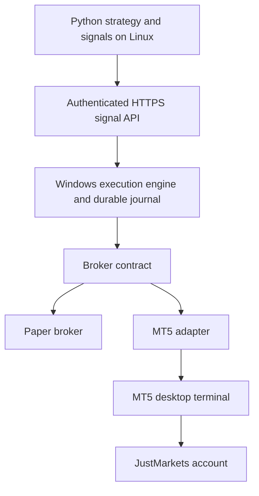

# Babayaga — broker-neutral research and protected MT5 execution

Babayaga retains its Python features, PPO, historical research workflow, SQLite journal
and existing Supabase outbox. The new execution path supports an ordinary MetaTrader 5
account, including JustMarkets. There is **no JustMarkets REST trading API** in this project.

**Default: paper.** Demo execution requires a verified DEMO account. Live execution
requires both `MT5_MODE=live` and `ALLOW_LIVE_TRADING=true`, plus all runtime gates.
No real trades were placed during development. Mock tests are not proof of profitability
or proof of compatibility with a particular broker account.

## Architecture



- `truetrade/brokers/base.py`: typed signals, quotes, symbol metadata and broker protocols.
- `brokers/paper.py`: existing paper executor, now sharing the broker contract.
- `brokers/mt5.py`: only module importing the official `MetaTrader5` package; lazy import.
- `risk/cfd.py`: account-currency stop-risk sizing using terminal profit/margin callbacks.
- `execution/engine.py`: durable decision IDs, request binding, intents, duplicate suppression,
  post-fill verification, emergency closure, persistent halt and reconciliation.
- `execution/agent.py`: single-process Windows agent, authenticated bounded HTTP API,
  TLS required for non-loopback binding, persistent journal and five-second position checks.
- `execution/remote.py`: Linux-safe client; no order retries after timeout or uncertain outcome.
- `worker/`: closed-bar policy inference, durable signal outbox, restart recovery, and Railway status server.
- `cfd/`: gold CFD simulation, chronological PPO training, qualification registry and demo feedback.

`truetrade.worker.mt5` is now the Railway start command. It reads closed candles through
the Windows agent and defaults to `ppo_cfd`. It collects real gold history, trains and
evaluates candidates, and only activates a qualified model for demo. It durably records
bar/decision before POST and verifies the agent journal afterwards. Live additionally
requires explicit flags and forward-demo evidence for the identical model weights.
See [Railway setup](docs/RAILWAY_MT5.md) and [gold learning and promotion](docs/GOLD_PPO.md).

`truetrade.main` remains the legacy research/collection worker and can be run explicitly.
The existing PPO code and training workflow are preserved; no trained CFD model is
bundled or silently substituted. Without a qualified model the worker blocks orders;
it never falls back to `breakout_demo`. That explicit demo-only rule remains available
for execution testing. Initial learned-policy scope is XAUUSD on USD accounts.
Strategy modules never import or call MetaTrader5.

Code classification and retained limitations: [migration review](docs/MT5_MIGRATION.md).
The previous setup, training and The True Trade instructions are preserved in
[legacy documentation](docs/LEGACY_TRUETRADE.md). The legacy exchange write block remains.

## Install and test (no account needed)

Python 3.11+; CI uses Python 3.12 on Linux and Windows. MT5 itself is not installed in tests.

```bash
git clone --branch feature/justmarkets-mt5 https://github.com/sjdpluse/babayaga.git
cd babayaga
python -m venv .venv
# Activate .venv for your shell, then:
python -m pip install -r requirements.txt
python -m unittest discover -s tests -v
python -m truetrade.main --once
```

Focused MT5 tests:

```bash
python -m unittest discover -s tests -p test_mt5.py -v
```

`tests/fake_mt5.py` supplies deterministic fixtures. Tests never initialize a real terminal.
The end-to-end fixture deliberately uses distinct order ticket, deal ticket, position
ticket and position identifier. It demonstrates XAUUSD signal → risk → valid lots →
request → simulated fill → SL/TP readback → protected journal state.

Fixture values (not current market prices or broker contract specifications): equity
10,000 account-currency units; Bid/Ask 2000/2000.2; stop 1990.2; risk 1%; 100 units per lot;
20-point entry and exit allowances at point 0.01; round-trip commission 7 per lot.
The budget is 100, the rounded volume is **0.09 lots**, and estimated loss including
allowances/commission is **94.23**. Duplicate delivery produces no second order;
lost execution response survives restart as unknown; live without authorization is rejected.

## Connect a JustMarkets DEMO account on Windows

1. Use a **dedicated MT5 DEMO trading account**, not the website login, IB account,
   or an MT4 account. If creating a new account in the JustMarkets Personal Area,
   choose a demo account on MT5. Copy its trading login, trading password and exact
   server from that account's details. Broker-specific server names are never guessed.
2. Install the MT5 desktop terminal provided for your account. In MT5, use
   **File → Login to Trade Account** with those details. Confirm it is your demo account
   and that quotes update. Use the trading/master password, not an investor password.
3. In **Tools → Options → Expert Advisors**, permit algorithmic trading and clear
   **Disable automated trading through the external Python API**. Keep the terminal's
   Algo Trading permission enabled. These settings affect execution permissions;
   the agent independently checks them and verifies DEMO using `account_info().trade_mode`.
4. Use a hedging account. This version rejects netting accounts and new entries when
   foreign/manual positions or pending orders exist. Do not run other EAs on this account.
5. Install matching 64-bit Python and the Windows extra in the same environment:

```powershell
py -3.12 -m venv .venv
.\.venv\Scripts\Activate.ps1
python -m pip install -r requirements.txt
python -m pip install -e ".[mt5]"
python -m unittest discover -s tests -v
```

6. Set environment variables in the PowerShell session. Replace prompts with your
   actual values. The password is entered using a hidden prompt rather than a literal
   in command history. Environment variables are read directly; `.env` is not auto-loaded.

```powershell
$env:MT5_LOGIN = Read-Host "MT5 DEMO trading login"
$env:MT5_SERVER = Read-Host "Exact demo server from account details"
$env:MT5_TERMINAL_PATH = Read-Host "Full path to terminal64.exe"
$credential = Get-Credential -UserName $env:MT5_LOGIN -Message "MT5 DEMO trading password"
$env:MT5_PASSWORD = $credential.GetNetworkCredential().Password
$env:MT5_MODE = "demo"
$env:ALLOW_LIVE_TRADING = "false"
$env:MT5_COMMISSION_PER_LOT = Read-Host "Reviewed round-trip commission per lot in account currency (0 only if verified)"
$env:MT5_RESEARCH_SWAP_LONG_PER_LOT_DAY = Read-Host "Reviewed conservative long rollover USD cost per lot per day"
$env:MT5_RESEARCH_SWAP_SHORT_PER_LOT_DAY = Read-Host "Reviewed conservative short rollover USD cost per lot per day"
$env:MT5_RESEARCH_ROLLOVER_UTC_HOUR = Read-Host "Reviewed UTC rollover hour (0-23)"
$env:MT5_RESEARCH_TRIPLE_WEEKDAY = Read-Host "Reviewed triple-cost weekday (0=Monday to 4=Friday)"
$env:MT5_MAX_SPREAD_POINTS = Read-Host "Maximum permitted spread in SYMBOL points"
$env:MAX_TRADE_RISK = "0.005"
$env:MT5_STATE_DIR = "$PWD\data\mt5-demo"
$env:MT5_AGENT_TOKEN = python -c "import secrets; print(secrets.token_urlsafe(48))"
$env:MT5_AGENT_URL = "http://127.0.0.1:8787"
python -m truetrade.execution.agent
```

Keep this process and the desktop terminal running. `MT5_AGENT_TOKEN` must be shared
securely with the client process; do not paste it into GitHub, logs or chat.
For a same-machine demo, another PowerShell session needs `MT5_AGENT_URL` and that same
token. Alternatively, configure these session variables before starting the agent as
a separate process so the child inherits them.

For **automatic PPO demo operation**, use the Railway settings in
[the worker runbook](docs/RAILWAY_MT5.md), or start `python -m truetrade.worker.mt5`
in another configured client session with `MT5_MODE=demo`, `MT5_STRATEGY=ppo_cfd` and
durable `STATE_DIR`. Give the terminal enough real XAUUSD M5 history. It waits for
50,000 bars/180 days and successful model qualification before generating trades.
The manual connectivity commands below are optional and do not train a model.

7. In the client session, inspect connection and XAUUSD without placing an order:

```powershell
python -m scripts.mt5_demo --symbol XAUUSD
```

Expected: `connected=true`, `mode=demo`, `execution_allowed=true`, valid symbol metadata
and fresh quotes. A process being alive does not mean trading is allowed. If `XAUUSD`
is absent and exactly one suffix match exists it is selected. Multiple suffix matches
are rejected. Resolve an ambiguity explicitly, then restart the agent:

```powershell
$env:MT5_SYMBOL_MAP = '{"XAUUSD":"EXACT_SYMBOL_FROM_YOUR_TERMINAL"}'
```

8. To execute one deliberate **demo-only** signal, choose current valid SL/TP levels
   and a stable unique decision ID. The following command prompts for prices; it does
   not contain a trading recommendation or an invented current gold price:

```powershell
$stopPrice = Read-Host "Chosen XAUUSD buy stop-loss price"
$targetPrice = Read-Host "Chosen XAUUSD buy take-profit price"
$decisionId = Read-Host "Unique stable decision ID (letters/numbers/hyphens)"
python -m scripts.mt5_demo --symbol XAUUSD --side LONG --stop $stopPrice --take-profit $targetPrice --risk 0.005 --decision-id $decisionId --send
```

`--send` is required. This CLI additionally refuses an agent reporting paper or live
mode. The server still enforces the actual terminal account type on every write.
Inspect the returned observed volume, entry, SL and TP and the terminal Trade tab.
Positions stay open until their SL/TP or an explicit close; this is not an auto-close demo.

If the response is lost, **do not regenerate an ID or rerun the signal command**. Query:

```powershell
python -m scripts.mt5_demo --decision-status $decisionId
```

A signal contains its original `created_at` and `expires_at`; reusing an ID with
changed content is rejected. Automated producers must durably save the original
signal before submitting, then query status after any transport uncertainty.

## Environment variables

| Variable | Use / default |
|---|---|
| `MT5_LOGIN`, `MT5_PASSWORD`, `MT5_SERVER`, `MT5_TERMINAL_PATH` | Windows-only trading credentials and exact terminal path; required even for terminal-backed paper data |
| `MT5_MODE` | `paper` (default), `demo`, `live` |
| `ALLOW_LIVE_TRADING` | `false`; only the literal `true` (case-insensitive) enables the second live gate |
| `MT5_AGENT_TOKEN` | Required shared random secret, at least 32 characters |
| `MT5_AGENT_URL` | Client origin; HTTPS required except explicit loopback HTTP |
| `MT5_AGENT_HOST`, `MT5_AGENT_PORT` | Agent binds `127.0.0.1:8787` by default |
| `MT5_AGENT_TLS_CERT`, `MT5_AGENT_TLS_KEY` | PEM certificate/private-key paths; both required for network binding |
| `MT5_STATE_DIR` | Durable Windows directory; default `data/mt5-<mode>` |
| `MT5_ALLOWED_SYMBOLS` | Comma-separated signal allowlist; default `XAUUSD` |
| `MT5_SYMBOL_MAP` | Optional JSON mapping to exact terminal symbols |
| `MT5_MAGIC` | Ownership marker, default `730021`; use a dedicated account and one agent |
| `MT5_COMMISSION_PER_LOT` | **No default**; round-trip estimate in account currency per lot; required to size |
| `MT5_RESEARCH_SWAP_LONG_PER_LOT_DAY`, `MT5_RESEARCH_SWAP_SHORT_PER_LOT_DAY` | Windows; reviewed nonnegative USD rollover costs per lot/day; mandatory for gold learning |
| `MT5_RESEARCH_ROLLOVER_UTC_HOUR`, `MT5_RESEARCH_TRIPLE_WEEKDAY` | Windows; reviewed rollover calendar, no defaults; see gold runbook |
| `MT5_MAX_SPREAD_POINTS` | Default 50 **points**, not pips or dollars; review for each symbol |
| `MT5_DEVIATION_POINTS`, `MT5_EXIT_SLIPPAGE_POINTS` | Default 20 each; modeled allowances, not guaranteed fills |
| `MAX_TRADE_RISK` | Existing maximum 5% ceiling; example setup lowers it to 0.5% |
| `MAX_PORTFOLIO_RISK`, `MAX_MARGIN_UTILIZATION` | Existing aggregate risk and margin ceilings, defaults 10% / 50% |
| `CIRCUIT_ENABLED`, `CIRCUIT_DRAWDOWN` | Existing drawdown circuit, defaults true / 15%; MT5 peak equity persisted |
| `MT5_STRATEGY` | Worker default `ppo_cfd`; `breakout_demo` only by explicit demo selection |
| `CFD_AUTO_TRAIN`, `CFD_TRAIN_EPISODES` | Worker: `true`, `2000`; automatic candidate training is demo-only |
| `CFD_MODEL_REGISTRY` | Default `STATE_DIR/cfd/active.json`; live requires a separately approved release |

MT5 volume is lots. Prices use tick size and digits; stops/freeze distances use points.
The adapter evaluates loss and margin in the account currency using terminal calculators.
It does not assume every account is USD or every Forex/CFD contract behaves like crypto.

## Railway / Windows VPS deployment

The Linux brain sends `Signal` objects through `SignalClient`. Deploy the Windows agent
on a Windows VPS with the terminal installed and logged into the intended account.
Run under the same Windows user/session as the terminal. Test logout/reboot behavior
on that VPS before relying on unattended operation. This is an ordinary Windows VPS,
not an MQL5-only virtual-hosting slot.

For cross-machine traffic, configure `MT5_AGENT_HOST`, a trusted TLS certificate/key,
firewall rules limited to your client/private network, and the shared token. Set the
Linux client's `MT5_AGENT_URL` to the corresponding HTTPS origin. Redirects are rejected;
TLS verification is never disabled. Prefer a private network; do not expose the agent
unrestricted to the internet. The small HTTP service is not a general public API gateway.

Run **one agent for one dedicated account**, with one durable state directory. A file
lease prevents duplicate local processes using that directory. This does not coordinate
multiple VPS instances or agents deliberately pointed at different directories. Never
scale the execution agent to multiple replicas. Back up its SQLite database and WAL
using a consistent SQLite backup procedure; do not discard state to clear a halt.

The Windows journal uses the existing audit/outbox schema. The existing Supabase sink
is preserved, but the new agent does not automatically flush its outbox to Supabase.
Remote archival/monitoring integration is a remaining operational task. Worker decisions
and received candles persist separately in `STATE_DIR/mt5-worker.sqlite`; the authoritative
execution journal stays on Windows. The worker does not require a separate SQL server.

Authenticated API: GET `/health`, `/status`, `/execution-state`, `/decisions/{id}`, `/outcome/{id}`;
POST `/signals`, `/market`, `/candles`, `/history`, `/research-contract`, `/reconcile`.
There is no API for changing credentials, enabling live mode,
or resetting unknown orders. Generic strategies depend on the broker contracts and
signal client, never on the terminal package.

## Safety, reconciliation and limitations

- Before entries: connection, exact account identity/type, permissions, symbol,
  quote freshness, spread, volume grid, stop distance, monetary risk, margin and
  terminal `order_check`. No order is sent if required metadata/costs are missing.
- After sending: result code and deal/order identity, new owned position, actual
  volume and entry, exact SL/TP, and current monetary/aggregate risk are checked.
  Partial fills and unexpected execution become uncertain, never silently successful.
- Unknown outcomes halt persistently. An attributable bad fill/protection causes one
  emergency close attempt. Even if closure succeeds, the halt remains until explicit
  reconciliation. Broker errors and empty successful reads are treated differently.
- Reconciliation verifies closure through positions **and deal history**. Unknown
  submissions without a resolvable ID stay halted for manual history investigation.
  There is intentionally no blind retry or unsafe reset endpoint. A broker changing
  tickets or withholding immediate deal history can require manual resolution.
- No netting support, pending-order strategy, automatic reconnection/relogin, or
  guaranteed fill during gaps/outages. Long-only/short-only symbol modes are conservatively
  rejected for new entries. Adapter-level close and SL/TP modification are available;
  remote management endpoints are not exposed in this first version.
- Use engine-managed protection only. External/manual changes to a recorded position
  are treated as a mismatch by the periodic verifier and can cause an emergency close.
  Dynamic strategy stop-management needs its own journaled management integration.
- The paper broker is an in-memory execution simulator, not a marked-to-market CFD
  backtester. Terminal-backed paper uses a virtual 10,000 balance in the connected
  account currency. Agent restart with protected paper inventory is rejected to avoid
  silently losing that inventory.
- Fee, spread and slippage defaults are engineering limits, not JustMarkets guarantees.
  Commission/limits are currently global to an agent; separate instances/accounts or
  a reviewed per-symbol extension are needed for heterogeneous fee schedules.
- Historical PPO/feature code is preserved. The gold workflow uses a separate CFD
  simulator with real lot metadata, Bid/Ask, fees, gap losses and reviewed overnight
  costs. It does not reuse the crypto environment. Only qualified demo candidates
  are automatically activated; live promotion is explicit. No actual gold model or
  performance result is bundled. Bar-level simulation and closed-trade forward
  evidence have limitations documented in [GOLD_PPO.md](docs/GOLD_PPO.md).

Before live use: verify the installed MT5 package/terminal and exact broker account on
Windows; validate both directions, fills, SL/TP, restart/outage recovery and account
currency conversion on demo; calibrate costs including overnight swap and gap risk;
validate the strategy out-of-sample; add operational monitoring, backup and manual
incident procedures. The two live flags are necessary authorization gates, not a
statement that a strategy is safe or profitable.

## Primary references

- [MetaQuotes Python integration](https://www.mql5.com/en/docs/python_metatrader5)
- [Order requests/results](https://www.mql5.com/en/docs/python_metatrader5/mt5ordersend_py)
- [Account-currency profit calculation](https://www.mql5.com/en/docs/python_metatrader5/mt5ordercalcprofit_py)
- [Order checks](https://www.mql5.com/en/docs/python_metatrader5/mt5ordercheck_py)
- [Symbol properties](https://www.mql5.com/en/docs/constants/environment_state/marketinfoconstants)
- [Terminal permissions](https://www.metatrader5.com/en/terminal/help/startworking/settings)
# bbyg

